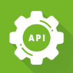

  

# Especialista Spring REST - ESR

<h4 align="center"> 
	 Status: Under development.
</h4>

 

**Record of notes, classes and applications made and learned throughout the course.**

---

  <a href="#about">About</a> •
  <a href="#programmatic-content">Programmatic content</a><!-- •
  <a href="#preview">Preview</a> •
  <a href="#tech-stack-and-tools">Tech Stack and tools</a> •
  <a href="#publication">Publication</a> •
  <a href="#author">Author</a>--> 

---

## About
 

> Learning from basics to advanced in applications built with Framework Spring together with [AlgaWorks](https://github.com/algaworks), [Thiago Faria](https://github.com/thiagofa) (course instructor) , tutors, as well as other students.
 

- Learning is also the reason of many comments in the code.

## Programmatic content
 

- [1. Introduction](#1-introduction)
- [2. Spring and Dependency Injection](#2-spring-and-dependency-injection)

---

### 1. Introduction

 

1.01. Introduction to training

1.02. How to use AlgaWorks support

1.03. Why develop REST APIs?

1.04. Understanding the Course Design Domain Model

1.05. Preparing the development environment: JDK and STS for Eclipse

### 2. Spring and Dependency Injection

 

2.01. Why learn and use Spring?

2.02. Getting to know the Spring ecosystem

2.03. Spring vs Jakarta EE (Java EE)

2.04. Getting to know Spring Boot

2.05. Creating a Spring Boot project with Spring Initializr

2.06. Getting to know Maven and the pom.xml of a Spring Boot project

2.07. Creating a controller with Spring MVC

2.08. Faster application restart with DevTools